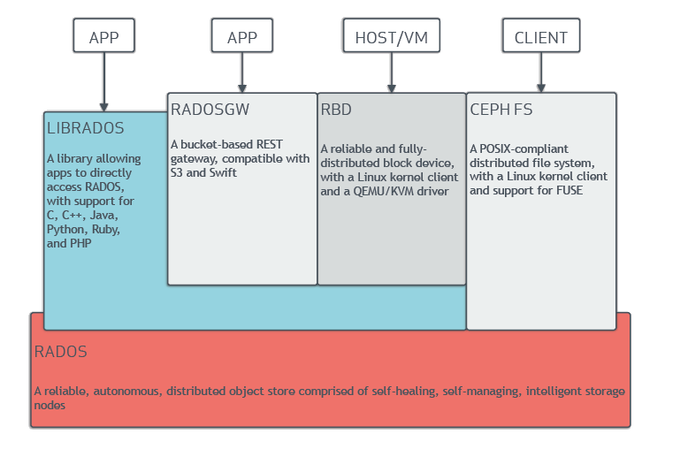
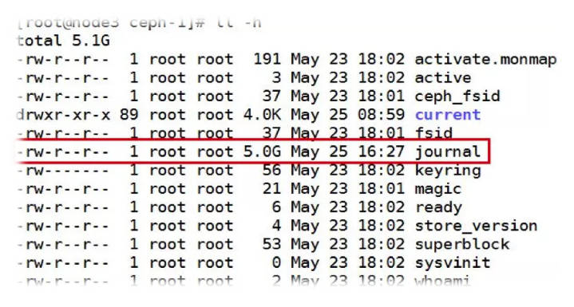

# 简介

---
## 一、Ceph介绍：
Ceph 是一个可靠的、自动重均衡、自动恢复的分布式存储系统，根据场景划分可以将 Ceph 分为三大块，分别是对象存储、块设备存储和文件系统服务。三种应用场景都在底层的RADOS之上运行，最后都会被转换成对象存储在各个pool的placement group(PG)中。
Ceph 的核心组件包括 Ceph OSD、Ceph Monitor、Ceph Manager和 Ceph MDS。

* Ceph OSD：OSD 的英文全称是 Object Storage Device，它的主要功能是存储数据、复制数据、平衡数据、恢复数据等，Ceph OSD 的架构实现由物理磁盘驱动器、Linux文件系统和 Ceph OSD 服务组成。
* Ceph Monitor：负责监视 Ceph 集群，维护Ceph 集群的健康状态，同时维护着 Ceph 集群中的各种 Map 图，比如 OSD Map、Monitor Map、PG Map 和 CRUSH Map。
* Ceph Manager: 负责跟踪运行时指标和Ceph集群的当前状态，包括存储利用率、当前性能指标和系统负载。
* Ceph MDS：全称是 Ceph MetaData Server，主要保存的文件系统服务的元数据，但对象存储和块存储设备是不需要使用该服务的。

对于一个用于对象存储的Ceph集群来说，它至少需要部署一个Monitor服务、一个Manager服务和一个OSD服务。其中，这些组件可以部署在同一台机器，即一个机器可以拥有多个角色（服务）。

若要保证数据可靠性，系统中应当有多个OSD节点，以实现副本或纠删码功能。Ceph默认的策略是3副本，这意味着在该策略下集群中至少要有3个OSD节点才能正常运作。（副本策略和纠删码配置均可更改）

## 二、Ceph的优势可以概括为以下四个方面：

#### 1、高性能
* 摒弃了传统的集中式存储元数据寻址的方案，采用CRUSH算法，数据分布均衡，并行度高
* 考虑了容灾域的隔离，能够实现各类负载的副本放置规则，例如跨机房、机架感知等
* 能够支持上千个存储节点的规模。支持TB到PB级的数据

#### 2、高可用
*  副本数可以灵活控制
*  支持故障域分隔，数据强一致性
*  多种故障场景自动进行修复自愈
*  没有单点故障，自动管理  

#### 3、高扩展性
*  去中心化
*  扩展灵活
*  随着节点增加，性能线性增长

#### 4、特性丰富
*  支持三种存储接口：对象存储，块设备存储，文件存储
*  支持自定义接口，支持多种语言驱动

## 三、Ceph基本结构
#### Ceph的基本组成结构如下图：

* Ceph的底层是RADOS，RADOS本身也是分布式存储系统，Ceph所有的存储功能都是基于RADOS实现的。RADOS采用C++开发，所提供的原生Librados API包括C和C++两种。Ceph的上层应用调用本机上的librados API，再由后者通过socket与RADOS集群中的其他节点通信并完成各种操作。

* RADOS GateWay、RBD其作用是在librados库的基础上提供抽象层次更高、更便于应用或客户端使用的上层接口。其中RADOS GW是一个提供与Amazon S3和Swift兼容的RESTful API的gateway，以供相应的对象存储应用开发使用。RBD则提供了一个标准的块设备接口，常用于在虚拟化的场景下为虚拟机创建volume。目前，RedHat已经将RBD驱动集成在KVM/QEMU中，以提供虚拟机访问性能。这两种方式目前在云计算中应用的比较多。

* CephFS则提供了POSIX接口，用户可直接通过客户端挂载使用。它是内核态的程序，所有无需调用用户空间的librados库。它通过内核中的net模块来与RADOS进行交互。

## 四、Ceph基本组件及概念
#### Ceph基本组件  
  
如上图所示，Ceph主要有三个基本进程：
* OSD  
用于集群中所有数据与对象的存储。处理集群数据的复制、恢复、回填、再均衡。并向其他osd守护进程发送心跳，然后向Mon提供一些监控信息。  
当Ceph存储集群设定的数据有两个副本时（一共存两份），则至少需要两个OSD守护进程，即两个OSD节点，集群才能到达active+clean状态。

* MDS(可选)  
为Ceph文件系统提供元数据计算、缓存与同步。在Ceph中，元数据也是存储在osd节点中的，mds类似于元数据的代理缓存服务器。MDS进程并不是必须的进程，只有需要使用CephFS时，才需要配置MDS节点。  
* Monitor
监控整个集群的状态，维护集群的cluster MAP二进制表，保证集群数据的一致性。ClusterMAP描述了对象块存储的物理位置，以及一个将设备聚合到物理位置的桶列表。

## 五、概念
* Object  
Ceph最底层的存储单元，每个Object包含元数据和原始数据。

* PG  
全称Placement Groups，是一个逻辑的概念，一个PG包含多个OSD。引入PG这一层其实是为了更好的分配数据和定位数据。

* RADOS  
全称Reliable Autonomic Distributed Object Store，是Ceph集群的精华，用户实现数据分配、Failover等集群操作。

* Librados  
Librados是RADOS提供的库。因为RADOS很难直接访问，因此上层的RBD、RGW和CephFS都是通过Librados访问的。

* CRUSH  
是Ceph使用的数据分布算法，让数据分配到预期的地方。

* RBD  
全称RADOS block device，是Ceph对外提供的块设备服务。

* RGW  
全称RADOS GateWay，是Ceph对外提供的对象存储服务，接口与S3、Swift兼容。

* CephFS  
全称Ceph File System，是Ceph对外提供的文件系统服务。
## 六、Ceph 核心组件
Ceph的核心组件包括Ceph OSD、Ceph Monitor和Ceph MSD。
#### OSD
首先介绍下Ceph数据的存储过程，如下图：
  

无论使用哪种存储方式（对象、块、文件系统），存储的数据都会被切分成对象（Objects）。Objects size大小可以由管理员调整，通常为2M或者4M。每个对象都会有一个唯一的OID，有ino和ono生成：ino是文件的File ID，用于全局唯一标示每一个文件，而ono是分片的编号。例如，一个文件FileID是A，它被切成两个对象，一个编号为0，另一个编号为1，那么这两个对象的OID则为A0和A1。OID的好处是可以唯一标示每一个不同的对象，并且存储了对象与文件的从属关系。由于Ceph的所有数据都虚拟成了整齐划一的对象，所以在读写时效率都会比较高。

但是对象并不会直接存储进OSD中，因为对象的size很小，在一个大规模的集群中可能有几百到几千万个对象。如此多的对象光是遍历寻址速度都会很缓慢；而且如果将对象直接通过某种固定映射的哈希算法映射到osd上，当这个osd损坏时，对象无法自动迁移到其他osd上面（因为映射函数不允许）。为了解决这些问题，Ceph引入了归置组的概念，即PG。

PG是一个逻辑概念，Linux系统中可以直接看到对象，但是无法直接看到PG。它在数据寻址时类似于数据库中的索引：每个对象都会固定映射进一个PG中，所以当我们寻找一个对象时，只需要先找到对象所属的PG，然后遍历这个PG就可以了，无需遍历所有对象。而且在数据迁移时，也是一PG作为基本单位进行迁移，Ceph不会直接操作对象。

对象是如何映射进PG的？首先使用静态hash函数对OID做hash取出特征码，用特征码与PG的数量取模，得到的序号就是PGID。由于这种设计，PG的数量多寡直接决定了数据分布的均匀性，所以合理设置的PG数量可以很好地提升Ceph集群的性能并使数据均匀分布。

最后PG会根据管理员设置的副本数量进行复制，然后通过CRUSH算法存储到不同的OSD节点上（其实是把PG中的所有对象存储到节点上），第一个osd节点即为主节点，其余均为从节点。

下面是一段Ceph中的伪代码，简要描述了Ceph的数据存储流程：
```bash
locator = object_name
obj_hash = hash(locator)
pg = obj_hash % num_pg
osds_for_pg = crush(pg) # return a list of osds
primary = osds_for_pg[0]
replicas = osds_for_og[1:]
```
     

上图中更好地诠释了Ceph数据流的存储过程，数据无论是从三个接口哪一种写入的，最终都要切分成对象存储到底层的RADOS中。逻辑上通过算法先映射到PG上，最终存储进OSD节点里。图中除了之前介绍过的概念之外多了个pools的概念。


Pool是管理员自定义的命名空间，像其他的命名空间一样，用来隔离对象与PG。我们在调用API存储，即使用对象存储时，需要指定对象要存储进哪一个POOL中。除了隔离数据，我们也可以分别对不同的POOL设置不同的优化策略，比如副本数、数据清洗次数、数据块及对象大小等。  
OSD是强一致性的分布式存储，它的读写流程如下图：
  
Ceph的读写操作采用主从模型，客户端要读写数据时，只能向对象所对应的的主OSD节点发起请求。主节点在接受写请求时，会同步的向从OSD中写入数据。当所有的OSD节点都写入完成后，主节点才会向客户端报告写入完成的信息，因此保证了主从节点数据的高度一致性。而读取的时候，客户端也只会向主OSD节点发送读请求，并不会有类似数据库中读写分离的情况出现，这也是处于强一致性的考虑。由于所有写操作都要交给主OSD节点来处理，所以在数据量很大的时候，性能可能会比较慢，为了克服这个问题以及让Ceph能支持事务，每个OSD节点都包含一个journal文件，稍后介绍。

数据流向的介绍就先到这，现在回到正题：OSD进程。在Ceph中，每一个OSD进程都可以称作是一个OSD节点，也就是说，每台存储服务器可靠包含了众多的OSD节点，每个OSD节点监听不同的端口，类似于在同一台服务器上跑多个MySQL或Redis。每个OSD节点可以设置一个目录作为实际存储区域，也可以是一个分区、一整块硬盘。如下图，当前这台机器上跑了两个OSD进程，每个OSD监听4个端口，分别用于接收客户请求、传输数据、发送心跳、同步数据等操作。
  
如上图所示，osd节点默认监听tcp的6800到6803端口，如果同一台服务器上有多个OSD节点，则依次往后排序。

在生产环境中OSD最少可能都有上百个，所以每个OSD都有一个全局的编号，类似OSD0、OSD1、OSD2等等，序号根据OSD诞生的顺序排列，并且是全局唯一的。存储了相同PG的OSD节点除了想Mon节点发送心跳外，还会互相发送心跳信息以检测PG数据副本是否正常。

之前在介绍数据流向时说过，每个OSD节点都包含一个journal文件，如下图：
   
默认大小为5G，也就是说创建一个OSD节点，还没使用就要被journal占用5G的空间。这个值是可以调整的，具体大小要依据OSD的总大小而定。

Journal的作用类似于MySQL innodb引擎中的事务日志系统。当有突发的大量写入操作时，Ceph可以先把一些零散的，随机的IO请求保存到缓存中进行合并，然后在同一向内核发起IO请求。这样做效率会比较高，但是一旦OSD节点崩溃，缓存中的数据就会丢失，所以数据在还未写进硬盘时，都会记录到journal中，当OSD崩溃后重启时，会自动尝试从journal恢复因崩溃而丢失的缓存数据。因此journal的IO是非常密集的，而且由于一个数据IO两次，很大程度上也损耗了硬件的IO性能，所以通常在生产环境中，使用ssd来单独存储journal文件以提高Ceph的读写性能。

#### monitor节点
Mon节点监控着整个Ceph集群的状态信息，监听于tcp的6789端口。每个Ceph集群中至少要有一个Mon节点，官方推荐每个集群至少部署三台。Mon节点中保存了最新的版本集群数据分布图（Cluster Map）的主副本。客户端在使用时，需要挂载Mon节点的6789端口，下载最新的Cluster Map，通过CRUSH算法获得集群中各OSD的IP地址，然后再与OSD节点直接建立连接来传输数据。所以对于Ceph来说，并不需要有集中式的主节点用于计算与寻址，客户端分摊了这部分工作。而且客户端也可以直接和OSD通信，省去了中间代理服务器的额外开销。

Mon节点之间使用Paxos算法来保持各节点Cluster Map的一致性；各Mon节点的功能总体是一样的，相互间的关系可以被简单理解为主备关系。如果主Mon节点损坏，其他Mon存活节点超过半数时，集群还可以正常运行。当故障Mon节点恢复时，会主动从其他Mon节点拉取最新的Cluster Map。

Mon节点并不会主动轮询各个OSD的当前状态，相反，OSD只有在一些特殊情况下才会上报自己的信息，平常只会简单的发送心跳。特殊情况包括：1、新的OSD被加入集群；2、某个OSD发现自身或其他OSD发生异常。Mon节点在收到这些上报信息时，则会更新Cluster Map信息并加以扩缩。

Cluster Map信息是以异步且lazy的形式扩散的。Monitor并不会在每一次Cluster Map版本更新后都将新版广播至全体OSD，而是有OSD向自己上报信息时，将更新恢复给对方。类似的，各个OSD也是在和其他OSD通信时，如果发现对方的OSD中持有的Cluster Map版本较低，则把自己更新的版本发送给对方。
  
这里的Ceph除了管理网段外，设了两个网段，一个用于客户端读写传输数据，另一个用于各OSD节点之间同步数据和发送心跳信息等。这样做的好处是可以分担网卡的IO压力。否则在数据清洗时，客户端的读写速度会变得极为缓慢。

#### MDS
Mds是Ceph集群中的元数据服务器，而通常情况它都不是必须的，因为只有在使用CephFS的时候才需要它，而目前云计算中用到的更广泛的是另外两种存储方式。

Mds虽然是元数据服务器，但是它不负责存储元数据，元数据也是被切成对象存在各个OSD节点中，如下图：
  
在创建CephFS时，要至少创建两个Pool，一个用于存储数据，另一个用于存放元数据。Mds只是负责接收用户的元数据查询请求，然后从OSD中把数据取出来映射进自己的内存中供客户访问。所以Mds其实类似一个代理缓存服务器，替OSD分担了用户的访问压力，如下图：  


## 七、Ceph 各概念之间的关系
#### 存储数据与Object的关系
当用户要将数据存储到Ceph集群时，存储数据都会被分割成多个Object，每个Object都有一个Object ID，每个Object的大小是可以设置的，默认为4MB。Object可以看做是Ceph存储的最小存储单元。

#### Object 与 PG
由于Object的数量很多，所以Ceph引入了PG的概念用于管理Object，每个Object最后都会通过CRUSH计算映射到某个PG中，一个PG可以包含多个Object。

Ceph条带化之后，将获得N个带有唯一OID（即Object的id）。Object id是进行线性映射生成的，即有file的元数据、Ceph条带化产生的Object的序号连缀而成。此时object需要映射到PG中，该映射包括两部分：

* 1、有Ceph集群指定的静态Hash函数计算Object的OID，获取到其Hash值  
* 2、将该Hash值与mask进行操作，从而获得PG ID
根据RADOS的设计，假定集群中设定的PG总数为M（M一般为2的整数幂），则mask的值为M-1.由此，Hash值计算之后，进行按位与操作是想从所有PG中近似均匀地随机选择。基于该原理以及概率论的相关原理，当用于数据量庞大的Object以及PG时，获得到的PG ID是近似均匀的，

#### PG 与 OSD
由PG映射到数据存储的实际单元OSD中，该映射是由CRUSH算法来确定的，将PG ID作为该算法的输入，获得到包含N个OSD的集合，集合的第一个OSD被作为主OSD，其余的OSD则依次作为从OSD。N为该PG所在POOL下的副本数量，在生产环境中N一般为3；OSD集合中的OSD将共同存储和维护该PG下的Object。需要注意的是，CRUSH算法的结果不是绝对不变的，而是受其他因素的影响。其影响因素主要有以下两个：

当前系统状态，也就是Cluster Map（集群映射）。当系统中的OSD状态、数量发生变化时，Cluster Map可能发生变化，而这种变化将会影响到PG和OSD之间的映射
存储策略配置。这里的策略主要与安全相关。利用策略配置，系统管理员可以指定承载同一个PG的3个OSD分别位于数据中心的不同服务器乃至机架上，从而进一步改善存储的可靠性。
因此，只有在Cluster Map和存储策略都不发生变化的时候，PG和OSD之间的映射关系才是固定不变的。在实际使用中，策略已经配置通常不会改变。而系统状态的改变或者是因为设备损坏，或者是因为存储集群规模扩大。好在Ceph本身提供了对于这种变化的自动化支持，因而即便PG和OSD之间的映射关系发生了变化，并不会对应用造成困扰。事实上，Ceph正是需要有目的的利用这种动态映射关系。正是利用了CRUSH的动态特性，Ceph才可以将一个PG根据需要动态迁移到不同的OSD组合上，从而自动化地实现高可靠性、数据分布re-blancing等特性。

之所以在此次映射中使用CRUSH算法，而不是其他Hash算法，原因之一是CRUSH具有上述可配置特性，可以根据管理员的配置参数决定OSD的物理位置映射策略；另一方面是因为CRUSH具有特殊的“稳定性”，也就是当系统中加入新的OSD导致系统规模增大时，大部分PG与OSD之间的映射关系不会发生改变，只是少部分PG的映射关系会发生变化并引发数据迁移。这种可配置性和稳定性都不是普通Hash算法所能提供的。因此，CRUSH算法的设计也是Ceph的核心内容之一。

#### PG 与 PGP
PG是用来存放Object的，PGP相当于是PG存放OSD的一种排列组合。举个例子，比如有3个OSD，OSD.1、OSD.2和OSD.3，副本数是2，如果PGP的数目为1，那么PG存放的OSD组合就只有一种可能：[OSD.1，OSD.2]，那么所有的PG主从副本分别存放到OSD.1和OSD.2；如果PGP设为2，那么OSD组合就有两种，[OSD.1，OSD.2]和[OSD.1，OSD.3]，是不是很像数学中的排列组合，PGP就是代表这个意思。一般来说应该将PG和PGP的数量设置为相等。接下来我们来通过一组实验来进一步说明：

先创建一个名为testpool包含6个PG和6个PGP的存储池：
```bash

ceph osd pool create testpool 6 6
```
通过写数据后我们查看下PG的分布情况，使用以下命令：
```bash

ceph pg dump pgs | grep ^1 | awk '{print $1,$2,$15}'

dumped pgs in format plain
1.1 75 [3,6,0]
1.0 83 [7,0,6]
1.3 144 [4,1,2]
1.2 146 [7,4,1]
1.5 86 [4,6,3]
1.4 80 [3,0,4]
```
第1列为PG的ID，第2列为该PG所存储的对象数目，第3列为该PG所在的OSD。

我们扩大PG再看看：
```bash
ceph osd pool set testpool pg_num 12
```
再用上面的命令查询分布情况：
```bash
1.1 37 [3,6,0]
1.9 38 [3,6,0]
1.0 41 [7,0,6]
1.8 42 [7,0,6]
1.3 48 [4,1,2]
1.b 48 [4,1,2]
1.7 48 [4,1,2]
1.2 48 [7,4,1]
1.6 49 [7,4,1]
1.a 49 [7,4,1]
1.5 86 [4,6,3]
1.4 80 [3,0,4]
```
可以看到PG的数量增加到12个了，PG1.1的对象数量本来是75个，现在是37个，可以看到它把对象数分给新增的PG1.9了，刚好是38，加起来为75，而且可以看到PG1.1和PG1.9的OSD盘是一样的。而且可以看到OSD盘的组合还是那6种。

我们增加PGP的数量来看下，使用命令：
```bash
ceph osd pool set testpool pgp_num 12
```
在看下：
```bash
1.a 49 [1,2,6]
1.b 48 [1,6,2]
1.1 37 [3,6,0]
1.0 41 [7,0,6]
1.3 48 [4,1,2]
1.2 48 [7,4,1]
1.5 86 [4,6,3]
1.4 80 [3,0,4]
1.7 48 [1,6,0]
1.6 49 [3,6,7]
1.9 38 [1,4,2]
1.8 42 [1,2,3]
```
再看PG1.1和PG1.9，可以看到PG1.9不在[3,6,0]上，而是在[1,4,2]上，该组合时新增加的。可以知道增加PGP_NUM其实是增加了OSD盘的组合。

通过上述实验可以得出：

* 1、PG是指定存储池存储对象的目录有多少个，PGP是存储池PG的OSD分布组合个数
* 2、PG的增加会引起PG内的数据进行分裂，分裂到相同的OSD上新生成的PG中
* 3、PGP的增加会引起部分PG的分布变化，但是不会引起PG内对象的变动

#### PG 与 Pool
Pool也是一个逻辑存储概念，我们创建存储池pool的时候，都需要指定PG和PGP的数量，逻辑上来说PG是属于某个存储池的，就像Object是属于某个PG的一样。

下图表明了存储数据、Object、PG、Pool、OSD、存储磁盘的关系：
  

#### Ceph 条带化
众所周知，存储设备具有吞吐量限制，它影响读写性能和可扩展性能。所以存储系统通常都支持条带化以增加存储系统的吞吐量并提升性能，数据条带化最常见的方式是做RAID。与Ceph的条带化最相似的是RAID 0或者是“带区卷”。Ceph条带化提供了类似RAID 0的吞吐量，N路RAID镜像的可靠性已经更快速的恢复能力。

在磁盘阵列中，数据是以条带（stripe）的方式贯穿在磁盘阵列所有硬盘中的。这种数据的分配方式可以弥补OS读取数据量跟不上的不足。

1.将条带单元（stripe unit）从阵列的第一个硬盘到最后一个硬盘收集起来，就可以称为条带（stripe）。有的时候，条带单元也被称为交错深度。在光纤技术中，一个条带单元被叫做段。

2.数据在阵列中的硬盘上是以条带的形式分布的，条带化是指数据在阵列中所有硬盘中的存储过程。文件中的数据被分割成小块的数据段在阵列中的硬盘顺序上的存储，这个最小数据块就叫做条带单元。

决定Ceph条带化数据的3个因素：

* 对象大小：处于分布式集群中的对象拥有一个最大可配置的尺寸（例如，2MB，4MB等），对象大小应该足够大以适应大量的条带单元。  
* 条带宽度：条带有一个可以配置的单元大小，Ceph Client端将数据写入对象，分成相同大小的条带单元，除了最后一个条带之外；每个条带宽度，应该是对象大小的一部分，这样使得一个对象可以包含多个条带单元。  
* 条带总量：Ceph客户端写入一系列的条带单元到一系列的对象，这就决定了条带的总量，这些对象被称为对象集。当Ceph客户端写入的对象集合中的最后一个对象之后，它将会返回到对象集合中的第一个对象处。
## 八、CRUSH 算法
### 数据分布算法挑战
#### 数据分布和负载均衡：
* a.数据分布均衡，使数据能均匀地分布到各个节点上
* b.负载均衡，使数据访问读写操作的负载在各个节点和磁盘的负载均衡
#### 灵活应对集群伸缩：
* a.系统可以方便的增加或者删除节点设备，并且对节点失效进行处理
* b.增加或者删除节点设备后，能自动实现数据的均衡，并且尽可能少的迁移数据
#### 支持大规模集群：
* 要求数据分布算法维护的元数据相对较小，并且计算量不能太大。随着集群规模的增加，数据分布算法的开销相对较小

### CRUSH 算法说明
* CRUSH（Controlled Replication Under Scalable Hashing）是一种基于伪随机控制数据分布、复制的算法。Ceph是为大规模分布式存储系统（PB级的数据和成百上千台存储设备）而设计的，在大规模的存储系统里，必须考虑数据的平衡分布和负载（提高资源利用率）、最大化系统的性能以及系统的扩展和硬件容错等。CRUSH就是为解决上述问题而设计的。在Ceph集群里，CRUSH只需要一个简洁而层次清晰的设备描述，包括存储集群和副本放置策略，就可以有效地把数据对象映射到存储设备上，且这个过程是完全分布式的，在集群系统中的任何一方都可以独立计算任何对象的位置；另外，大型系统存储结构是动态变化的（存储节点的扩展或者缩容、硬件故障等），CRUSH能够处理存储设备的变更（添加或删除），并最小化由于存储设备的变更而导致的数据迁移。
* PG到OSD的映射过程的算法叫做CRUSH算法。
* CRUSH算法是一个伪随机的过程，它可以从所有的OSD中，随机性选择一个OSD集合，但是同一个PG每次随机选择的结果是不变的，也就是映射的OSD集合是固定的。

### CRUSH 基本原理
#### CRUSH 算法因子：

* **层次化的Cluster Map：** 反映了存储系统层级的物理拓扑结构。定义了OSD集群具有层级关系的静态拓扑结构。OSD层级使得CRUSH算法在选择OSD时实现了机架感知能力，也就是通过规则定义，使得副本可以分布在不同的机架、不同的机房中，提高数据的安全性
* **Placement Rules：** 决定了一个PG的对象副本如何选择的规则，通过这些可以自己设定规则，用户可以自定义设置副本在集群中的分布

### CRUSH 关系分析
从本质上讲，CRUSH算法是通过存储设备的权重来计算数据对象的分布。在计算过程中，通过Cluster Map（集群映射）、Data Distribution Policy（数据分布策略）和给出的一个随机数共同决定数据对象的最终位置。

#### Cluster Map
Cluster Map记录所有可用的存储资源以及可用的存储资源及相互之间的空间层次结构（集群中有多少个机架、机架上有多少个服务器、每个服务器上有多少磁盘等信息）。所谓Map，顾名思义，就是类似于我们生活中的地图。在Ceph存储里，数据的索引都是通过各种不同的Map来实现的。另一方面，Map使得Ceph集群存储设备在物理层做了一层防护。例如，在多副本结构上，通过设置合理的Map（故障域设置为Host级），可以保证在某一服务器死机的情况下，有其他副本保留在正常的存储节点上，能够继续提供服务，实现存储的高可用。设置更高的故障域级别（如Rack、Row等）能保证整机柜或同一排机柜在掉电情况下数据的高可用性和完整性。

#### 1.Cluster Map的分层结构
Cluster Map由Device和Bucket构成。它们都有自己的ID和权重值，并且形成一个以Device为叶子节点、Bucket为躯干的树状结果。
  
Bucket拥有不同的类型，如Host、Row、Rack、Room等，通常我们默认把机架类型定义为Rack，主机类型定义为Host，数据中心（IDC机房）定义为Data Center。Bucket的类型都是虚拟结构，可以根据自己的喜好设计合适的类型。Device节点的权重值代表了存储设备的容量与性能。其中，磁盘容量是权重大小的关键因素。

OSD的权重值越高，对应磁盘会被分配写入更多的数据。总体来说，数据会被均匀写入分布于集群所有磁盘，从而提高整体性能和可靠性。无论磁盘的规格容量，总能够均匀使用。

关于OSD权重值的大小值的配比，官方默认值设置为1TB容量的硬盘，对应权重为1。可以在/etc/init.d/ceph源码里查看相关的内容。

Bucket随机算法类型
  
* **一般的buckets：** 适合所有子节点权重相同，而且很少添加删除item  
* **list buckets：** 适用于集群扩展类型。增加item，产生最优的数据移动，查找item，时间复杂对为O(n)  
* **tree buckets：** 查找复杂的为O(log n)，添加删除叶子节点是，其它节点node_id不变 
* **straw buckets：** 允许所有项通过类似抽签的方式来与其它项公平“竞争”。定位副本时，bucket中的每一项都对应一个随机长度的straw，且拥有最长长度的straw会获得胜利（被选中）；添加或者重新计算，子树之间的数据移动提供最优的解决方案  

#### 2.恢复与动态平衡
在默认情况下，当集群里有组件故障时（主要是OSD，也可能是磁盘或者网络等），Ceph会把OSD标记为down，如果在300s内未能回复，集群就会开始进行恢复状态。这个“300s”可以通过“mon osd down ourt interval”配置选项修改等待时间。PG（Placement Groups）是Ceph数据管理（包括复制、修复等操作）单元。当客户端把读写请求（对象单元）推送到Ceph时，通过CRUSH提供的Hash算法把对象映射到PG。PG在CRUSH策略的影响下，最终会被映射到OSD上。
#### Data Distribution Policy
Data Distribution Policy由Placement Rules组成。Rule决定了每个数据对象有多少个副本，这些副本存储的限制条件（比如3个副本放在不同的机架中）。一个典型的rule如下所示：
```bash
rule replicated_ruleset {                   ##rule名字
      ruleset 0                             #rule的ID
      type replicated                       ##类型为副本模式，另外一种模式为纠删码（EC）
      min_size 1                            ##如果存储池的副本数大于这个值，此rule不会应用
      max_size 10                           ##如果存储池的副本数大于这个值，此rule不会应用
      step take default                     ##以default root 为入口
      step chooseleaf firstn 0 type host    ##隔离城为host级，即不同副本在不同的主机上
      step emit                             ##提交
}
```
根据实际的设备环境，可以定制符合自己需求的Rule。
#### CRUSH 中的伪随机
$$CRUSH(x) \quad \rightarrow \quad (osd1,osd2 \cdots\cdots osdN)$$

CRUSH使用了多参数的Hash函数，在Hash之后，映射都是按既定规则选择的，这使得从x到OSD的集合是确定的和独立的。CRUSH只使用Cluster Map、Placement Ruels、X。CRUSH是伪随机算法，相似输入的结果之间没有相关性。

下面通过计算PG的ID来看CRUSH的一个计算过程：

* 1、Client输入pool ID和对象ID（如pool='liverpool',object-id='john'）
* 2、CRUSH获得对象ID并对其Hash运算
* 3、CRUSH计算OSD个数，Hash取模获得PG的ID（如0x58）
* 4、CRUSH获得已命名pool的ID（如liverpool=4）
* 5、CRUSH预先考虑到pool ID相同的PG ID（如4.0x58）  
在Ceph集群里，当有数据对象要写入集群时，需要进行两次映射，第一次从Object-->PG，第二层是PG-->OSD set。每一次的映射都是与其他对象不相关的，这充分体现了CEUSH的独立性（充分分散）和确定性（可确定的存储位置）。
## 九、Ceph IO流程及数据分布
   

### 正常IO流程图
   

步骤：   
* 1、Client 创建Cluster handler
* 2、Client 读取配置文件
* 3、Client 连接上Monitor，获取集群map信息
* 4、Client 读写IO 根据Crushmap算法请求对应的主OSD数据节点
* 5、主OSD数据节点同时写入另外两个副本节点数据
* 6、等待主节点以及另外两个副本节点写完数据状态
* 7、主节点及副本节点写入状态都成功后，返回给Client，IO写入完成

### 新主IO流程图  
说明：

如果新加入的OSD1取代了原有的OSD4成为Primary OSD，由于OSD1上未创建PG，不存在数据，那么PG上的IO无法进行，怎样工作呢？
   
步骤：

* 1、Client 连接Monitor获取集群Map信息
* 2、同时新主OSD1由于没有PG，数据会主动上报Monitor告知让OSD2临时接替为主
* 3、临时主OSD2会把数据全量同步给新主OSD1
* 4、Client IO读写直接连接临时主OSD2进行读写
* 5、OSD2收到读写IO，同时写入另外两个副本节点
* 6、等待OSD2以及另外两副本写入成功
* 7、OSD2三分数据都写入成功返回给Client，此时Client IO读写完毕
* 8、如果OSD1数据同步完毕，临时主OSD2会交出主角色
* 9、OSD1成为主节点，OSD2变成副本

### Ceph IO算法流程

   

1、File用户需要读写文件，File->Object映射：
* 1、 ino（File的元数据，File的唯一ID）  
* 2、 ono（File切分产生的某个Object的序号，默认以4M切分一个块大小）
* 3、 oid（object id： ino + ono）  

2、Object是RADOS需要的对象。Ceph指定一个静态Hash函数计算OID的值，将OID映射成一个近似均匀分布的伪随机值，然后和mask按位相与，得到PGID。Object->PG映射：
* 1、 hash(oid) & mask -> pgid
* 2、 mask = PG总数m（m为2的整数幂）-1

3、PG（Placement Group），用途是对Object的存储进行组织和位置映射，类似Redis Cluster里面的slot的概念。一个PG里面会有很多Object。采用CRUSH算法，将PGID带入其中，然后得到一组OSD。PG->OSD映射：

* CRUSH(pgid) -> (osd1,osd2,osd3)

### Ceph RBD IO流程
  

步骤：

* 1、客户端创建一个Pool，需要为这个Pool指定PG的数量
* 2、创建pool/image RBD设备进行挂载
* 3、用户写入的数据进行切块，每个块的大小默认为4M，并且每个块都有一个名字，即Object+序号
* 4、将每个Object通过PG进行副本位置的分配
* 5、PG根据CRUSH算法会寻找3个OSD，把这个Object分别保存在这三个OSD上
* 6、OSD上实际是把底层的Disk进行了格式化操作，一般部署工具会将它格式化为xfs文件系统
* 7、Object的存储就变成了存储一个名为rbd0.object1.file的文件

### Ceph RBD IO框架图
   

客户端写数据OSD过程：

* 1、采用的是librbd的形式，使用librbd创建一个块设备，向这个块设备写入数据   
* 2、在客户端本地通过调用librados接口，然后经过pool、rbd、object、pg进行层层映射，在PG这一层中，可以知道数据保存在哪3个OSD上，以及这3个OSD的主从关系   
* 3、客户端与primary OSD建立socket通信，将要写入的数据传给primary OSD，由primary OSD再将数据发送给其他replica OSD数据节点   
### Ceph 数据扩容PG分布
场景数据迁移流程：

* 现状3个OSD，4个PG
* 扩容到4个OSD，4个PG
现状：
  

扩容后：
   

说明：

每个OSD上分布很多PG，并且每个PG会自动散落在不同的OSD上。如果扩容，那么相应的PG会自动迁移到新的OSD上，保证PG数量的均衡

## 十、Ceph心跳机制
### 心跳介绍
心跳是用于节点间检测对方是否发送故障，以便及时发现故障点进入相应的故障处理流程。

**问题：**

* 故障检测时间和心跳报文带来的负载之间做权衡
* 心跳频率太高则过多的心跳报文会影响系统性能
* 心跳频率过低则会延长发现故障节点的时间，从而影响系统的可用性  

**故障检测策略应该能够做到：**

* **及时：** 节点发生异常如宕机或网络中断时，集群可以在可接受的时间范围内感知
* **适当的压力：** 包括对节点的压力和网络的压力
* **容忍网络抖动：** 网络偶尔延迟
* **扩散机制：** 节点存活状态改变导致的元信息变化需要通过某种机制扩散到整个集群

### Ceph 心跳检查

OSD节点会监听public、cluster、front和back四个端口

* **public端口：** 监听来自Monitor和Client的连接
* **cluster端口：** 监听来自OSD Peer的连接
* **front端口：** 供客户端连接集群使用的网卡，这里临时给集群内部之间进行心跳
* **back端口：** 供集群内部使用的网卡，集群内部之间进行心跳
* **hbclient：** 发送ping心跳的messenger

### Ceph OSD之间相互心跳检查
   
步骤：

* 同一个PG内的OSD相互心跳，它们互相发送PING/PONG信息
* 每隔6s检测一次（实际会在这个基础上加一个随机时间来避免峰值）
* 20s没有检测到心跳回复，加入failure队列

### Ceph OSD与Mon心跳检测
  

### **OSD报告给Monitor：**

* OSD有事件发生时（比如故障、PG变更）  
* 自身启动5s内  
* OSD周期性的上报给Monitor   
  - OSD检查failure_queue中的伙伴OSD失败信息   
  - 向Monitor发送失效报告，并将失败信息加入failure_pending队列，然后将其从failure_queue移除   
  - 收到来自failure_queue或者failure_pending中的OSD的心跳时，将其从这两个队列中移除，并告知Monitor取消之前的失效报告
  - 当发生与Monitor网络重连时，会将failure_pending中的错误报告加回到failure_queue中，并再次发送给Monitor
* Monitor统计下线OSD
  - Monitor收集来自OSD的伙伴失效报告
  - 当错误报告指向的OSD失效超过一定阈值，且足够多的OSD报告其失效时，将该OSD下线
### **Ceph心跳检测总结**
Ceph通过伙伴OSD汇报失效节点和Monitor统计来自OSD的心跳两种方式判定OSD节点失效。

* **及时：** 伙伴OSD可以在秒级发现节点失效并汇报Monitor，并在几分钟内由Monitor将失效OSD下线
* **适当压力：** 由于有伙伴OSD汇报机制，Monitor与OSD之间的心跳统计更像是一种保险措施，因此OSD向Monitor发送心跳的间隔可以长达600s，Monitor的检测阈值也可以长达900s。Ceph实际上是将故障检测过程中中心节点的压力分散到所有的OSD上，以此提高中心节点Monitor的可靠性，进而提高这个集群的可靠性
* **容忍网络抖动：** Monitor收到OSD对其伙伴OSD的汇报后，并没有马上将目标OSD下线，而是周期性地等待几个条件：
  - 目标OSD的失效时间大于通过固定量osd_heartbeat_grace和历史网络条件动态确定的阈值
  - 来自不同主机的汇报到的mod_osd_min_down_reports
  - 慢速前两个条件失效汇报没有被源OSD取消
* **扩散：** 作为中心节点的Monitor并没有在更OSDMap后尝试广播通知所有的OSD和Client，而是惰性的等待OSD和Client来获取，以此来减少Monitor压力并简化交互逻辑

## 十一、Ceph通信框架
### Ceph通信框架种类介绍
#### **网络通信框架三种不同的实现方式：**
* **Simple线程模式**
  - **特点：** 每一个网络链接，都会创建两个线程，一个用于接收，一个用于发送
  - **缺点：** 大量的链接会产生大量的线程，会消耗CPU资源，影响性能
* **Async事件的I/O多路复用模式**  
  - **说明：** 这种是目前网络通信中广泛采用的方式。K版默认已经使用Async
* **XIO方式使用了开源的网络通信库accelio来实现**
  - **说明：** 这种方式需要依赖第三方库accelio的稳定性  

### Ceph通信框架设计模式
#### **设计模式（Subscribe/Publish）**
订阅发布模式又名观察者模式，它意图是”定义对象间的一种一对多的依赖关系，当一个对象的状态发生改变是，所有依赖于它的对象都得到通知并被自动更新“。
### Ceph通信框架流程图


步骤： 
* Accepter监听peer的请求，调用SimpleMessenger::add_accept_pip3()创建新的pipe到SimpleMessenger::pipes来处理该请求  
* Pipe用于消息的读取和发生。该类主要有两个组件：Pipe::Reader，Pipe::Writer用来处理消息读取和发送  
* Messenger作为消息的发布者，各个Dispatcher子类作为消息的订阅者，Messenger收到消息之后，通过Pipe对取消息，然后转给Dispatcher处理
* Dispatcher是订阅者的基类，具体的订阅者后端继承该类，初始化的时候通过Messenger::add_dispatcher_tail/head注册到Messenger::dispatchers。收到消息后，通知该类处理  
* DispatchQueue该类用来缓存收到的消息，然后唤醒DispatchQueue::dispatch_thread线程找到后端的Dispatch处理消息


### Ceph通信框架类图


### Ceph通信数据格式
通信协议格式需要双方约定数据格式。  
**消息的内容主要分为三部分：**
* header //消息头 类型消息的信封  
* user data //需要发送的实际数据  
  - payload //操作保存元数据  
  - middle //预留字段
  - data //读写数据
* footer //消息的结束标记

```
class Message : public RefCountedObject {
protected:
  ceph_msg_header  header;      // 消息头
  ceph_msg_footer  footer;      // 消息尾
  bufferlist       payload;  // "front" unaligned blob
  bufferlist       middle;   // "middle" unaligned blob
  bufferlist       data;     // data payload (page-alignment will be preserved where possible)

  /* recv_stamp is set when the Messenger starts reading the
   * Message off the wire */
  utime_t recv_stamp;       //开始接收数据的时间戳
  /* dispatch_stamp is set when the Messenger starts calling dispatch() on
   * its endpoints */
  utime_t dispatch_stamp;   //dispatch 的时间戳
  /* throttle_stamp is the point at which we got throttle */
  utime_t throttle_stamp;   //获取throttle 的slot的时间戳
  /* time at which message was fully read */
  utime_t recv_complete_stamp;  //接收完成的时间戳

  ConnectionRef connection;     //网络连接

  uint32_t magic = 0;           //消息的魔术字

  bi::list_member_hook<> dispatch_q;    //boost::intrusive 成员字段
};

struct ceph_msg_header {
    __le64 seq;       // 当前session内 消息的唯一 序号
    __le64 tid;       // 消息的全局唯一的 id
    __le16 type;      // 消息类型
    __le16 priority;  // 优先级
    __le16 version;   // 版本号

    __le32 front_len; // payload 的长度
    __le32 middle_len;// middle 的长度
    __le32 data_len;  // data 的 长度
    __le16 data_off;  // 对象的数据偏移量


    struct ceph_entity_name src; //消息源

    /* oldest code we think can decode this.  unknown if zero. */
    __le16 compat_version;
    __le16 reserved;
    __le32 crc;       /* header crc32c */
} __attribute__ ((packed));

struct ceph_msg_footer {
    __le32 front_crc, middle_crc, data_crc; //crc校验码
    __le64  sig; //消息的64位signature
    __u8 flags; //结束标志
} __attribute__ ((packed));
```